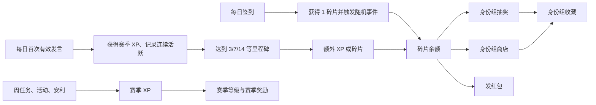

# Discord 社区活跃与身份组兑换 Bot 功能升级需求文档

> 文档状态：产品方案初稿  
> 适用对象：独立 Discord Bot（与 KimiBot 无业务依赖）  
> 核心目标：提升日活与持续参与，让成员通过“碎片”抽取或购买服务器身份组  
> 建议首赛季周期：6 周  
> 时区：服务器配置时区，默认 `Asia/Shanghai`  

## 1. 项目背景

服务器需要一套轻量、易理解、可持续运营的激励系统，将成员的日常发言、签到、内容安利、周任务和限时活动，转化为可见的成长与身份组奖励。

本 Bot 可以参考 KimiBot 的以下设计经验，但不直接依赖或复用其业务数据：

- 余额按服务器与用户隔离；
- 碎片保留 1 位小数，最小变动单位为 0.1；
- 所有增减均写入交易流水；
- 抽奖支持“身份组 / 碎片 / 空抽”三类结果；
- 重复身份组可返还碎片；
- 红包创建时先扣款，过期后退还未领取部分；
- 身份组支持原价、优惠价、优惠起止时间；
- 抽奖记录统计总抽数、空抽、碎片、身份组、重复、稀有度及净消耗。

新 Bot 应使用数据库和原子事务实现上述能力，不建议继续采用多个 JSON 文件作为正式环境的主要存储。

## 2. 产品目标与非目标

### 2.1 产品目标

1. 提升日活跃成员数（DAU）与 7 日、14 日活跃留存。
2. 鼓励每天至少一次有意义的发言，而不是鼓励刷屏。
3. 建立稳定、可调节、可追溯的碎片产出与消耗闭环。
4. 让身份组既可随机抽取，也可通过明确价格直接购买。
5. 通过六周赛季为运营提供节奏，但不清空成员已赚取的碎片与永久身份组。
6. 为管理员提供可视化配置、数据统计、异常审计和紧急开关。

### 2.2 非目标

- 不根据消息数量无限发放碎片或经验。
- 不奖励无意义刷屏、复制粘贴、表情轰炸或 Bot 消息。
- 不引入可用现实货币购买的随机抽奖。
- 首期不建设复杂交易市场、成员间身份组转售或碎片提现。
- 不让赛季机制成为使用签到、红包、身份组商店的前置门槛。

## 3. 核心概念

| 概念 | 用途 | 是否消费 | 是否跨赛季保留 |
| --- | --- | --- | --- |
| 碎片 | 抽奖、红包、直接购买身份组 | 是 | 是 |
| 赛季经验（XP） | 提升赛季等级 | 否 | 否 |
| 活跃日 | 当天完成首次有效发言 | 否 | 仅保留统计，赛季进度重置 |
| 连续活跃 | 连续自然日完成首次有效发言 | 否 | 中断后从 1 重新计算 |
| 收藏身份组 | 成员已经解锁的可装备身份组 | 否 | 由身份组配置决定，默认永久 |

设计原则：碎片是唯一可消费货币。“普通代币”和“高级代币”不再并存；抽取身份组和指定购买身份组都消耗碎片，以减少认知和开发成本。赛季经验只表达参与进度，不能转账或消费。

## 4. 核心用户流程

## 5. 功能需求

### 5.1 每日首次有效发言

#### 5.1.1 触发规则

- 每名成员每天最多因发言获得 1 次奖励。
- 仅统计管理员配置的可计分频道；公告、机器人命令、工单、日志、闲置区默认不计入。
- 消息必须由真人成员发送，且未被删除或判定为违规。
- 建议的基础有效性规则：
  - 去除链接、Discord 自定义表情、空白后，文本长度不少于 6 个字符；
  - 不能是纯数字、纯链接、仅图片或仅表情；
  - 拒绝 5 个以上连续重复字符；
  - 字符种类不少于 4 种；
  - 与该成员近期消息高度重复时不计入；
  - 被自动审核拦截的消息不计入。
- 首期无需使用 AI 判断内容质量，采用透明的确定性规则即可。
- 消息满足条件后立即记录，当日后续发言仅用于统计，不再增加 XP 或碎片。

#### 5.1.2 奖励与里程碑

- 每日首次有效发言：`+8 XP`。
- 连续活跃按自然日计算；断签后连续天数从 1 重新开始。
- 同一里程碑奖励每赛季只能领取一次，避免成员反复中断刷取低级里程碑。

| 连续活跃里程碑 | 奖励建议 | 设计目的 |
| --- | ---: | --- |
| 3 天 | 0.5 碎片 + 10 XP | 尽快给予首次正反馈 |
| 7 天 | 1.5 碎片 + 25 XP | 建立一周习惯 |
| 14 天 | 3 碎片 + 50 XP | 强化双周留存 |
| 21 天 | 4 碎片 + 75 XP | 覆盖半个赛季 |
| 30 天 | 6 碎片 + 100 XP | 月度核心活跃奖励 |
| 42 天 | 10 碎片 + 赛季纪念徽记 | 全勤荣誉奖励 |

同时记录“赛季累计活跃日”，该数值不会因中断而减少，用于赛季任务和数据分析。连续活跃负责仪式感，累计活跃负责降低成员因漏掉一天而彻底放弃的挫败感。

#### 5.1.3 反馈方式

- 默认不在每条消息下回复，避免污染聊天频道。
- 首次计入后可对消息添加一个管理员配置的 Reaction；成员可在 `/我的进度` 中确认。
- 达成里程碑时发送一次私密回复或指定成就频道通知。
- 管理员可配置是否公开成员里程碑。

#### 5.1.4 验收标准

- 同一成员同一服务器同一自然日最多获得一次发言奖励。
- 并发发送多条消息时不得重复入账。
- 未计分频道、Bot、Webhook 及无效内容不会触发奖励。
- 跨日以服务器配置时区为准，不能以进程本地时间隐式判断。

### 5.2 每日签到与随机事件

#### 5.2.1 基本规则

- 成员通过 `/签到` 或签到面板按钮完成签到。
- 每日基础奖励固定为 `+1.0 碎片`。
- 每次签到额外触发一个随机事件，事件分为正面、中立、负面。
- 事件结果与基础奖励合并结算，并展示本次净获得和最新余额。
- 余额不得低于 0；若负面事件会导致余额小于 0，则实际扣减至 0 为止。

#### 5.2.2 首赛季建议概率

| 类型 | 概率 | 随机变动 | 签到净获得范围 |
| --- | ---: | ---: | ---: |
| 正面 | 35% | `+0.1 ～ +0.9` | `+1.1 ～ +1.9` |
| 中立 | 40% | `0` | `+1.0` |
| 负面 | 25% | `-0.1 ～ -0.9` | `+0.1 ～ +0.9` |

所有随机金额以 0.1 为步长等概率抽取。该配置下随机事件期望值约为 `+0.05`，单次签到总期望约为 `1.05 碎片`，既保留惊喜，也不会让负面体验压过日常奖励。

#### 5.2.3 随机文案

- 文案库由管理员维护，每条包括：`event_id`、类型、标题、正文、权重、最小/最大变动、启用状态。
- 抽取顺序为“先抽事件，再在事件范围内抽金额”。
- 同一用户连续 3 天不应抽到同一个 `event_id`。
- 负面文案应轻松、无羞辱性，不涉及成员现实处境、疾病、灾难或金钱损失。
- 文案示例：
  - 正面：“你在频道角落捡到了一枚发光碎片，今天的运气似乎不错。”
  - 中立：“自动售货机认真运转了一圈，稳稳吐出了今日份碎片。”
  - 负面：“碎片在传送途中磕掉了一小角，但大部分仍安全抵达。”

#### 5.2.4 验收标准

- 每日只能签到一次，重复操作返回今日结算，不重复入账。
- 基础奖励、事件变动和最终实际变动均写入同一结算记录。
- 概率和金额区间可由管理员修改并留存版本。
- 所有概率之和必须为 100%，非法配置不得发布。

### 5.3 身份组抽奖

#### 5.3.1 奖池结果

每抽先决定结果类型，再在对应池中决定具体奖励：

| 结果 | 首赛季建议概率 | 说明 |
| --- | ---: | --- |
| 身份组 | 25% | 再按稀有度与类别抽取具体身份组 |
| 碎片 | 30% | 获得 `0.2 ～ 1.0` 碎片 |
| 空抽 | 45% | 无奖励，计入空抽记录 |

身份组池建议分为普通、稀有、传说三级；具体概率默认 `82% / 15% / 3%`，管理员可调。颜色身份组、图标身份组等互斥装备类型需分别标记，抽中新身份组后可提示“一键装备”。

#### 5.3.2 抽奖价格

| 类型 | 价格建议 |
| --- | ---: |
| 单抽 | 2 碎片 |
| 五连 | 9 碎片 |
| 十连 | 17 碎片 |

多抽优惠用于集中消耗，但折扣不应过大。按钮点击后须二次确认并展示消耗、当前余额和公开概率。

#### 5.3.3 重复与保底

- 重复身份组不重复赋权，转换为碎片：普通 1、稀有 3、传说 8。
- 连续 5 次空抽后，下一抽至少为“碎片”结果，随后清空空抽计数。
- 连续 20 抽未出身份组时，下一抽必出身份组，随后清空身份组保底计数。
- 保底进度按成员、服务器、奖池分别保存；换奖池时不得错误共用。
- 因奖池配置缺失导致无法发放时，不得算作正常空抽，应退款并记录系统异常。

#### 5.3.4 公平性要求

- 在抽奖面板明确展示结果概率、身份组稀有度概率、重复返还和保底规则。
- 每次抽奖保存所使用的 `pool_version`，防止配置变化后无法审计历史结果。
- 抽奖扣款、开奖、返还和收藏写入必须处于同一数据库事务；失败应整体回滚。
- 管理员不能编辑单个成员的抽奖结果，只能配置未来生效的奖池版本。

### 5.4 抽奖记录与总结

#### 5.4.1 个人记录

`/抽奖记录 [范围]` 支持“本次、近 7 天、本赛季、全部”，展示：

- 总抽数；
- 身份组出货数与出货率；
- 新身份组、重复身份组；
- 碎片结果次数与获得总额；
- 空抽次数与空抽率；
- 各稀有度出货数；
- 累计消耗、重复返还、碎片奖励、净消耗；
- 当前两个保底进度；
- 最近一次抽奖时间。

本次多抽完成后先展示简洁结果，再提供“查看详细战报”和“公开分享”按钮。默认结果仅本人可见，成员主动点击后才公开，避免十连结果刷屏。

#### 5.4.2 赛季与全服总结

- 每周生成一次全服匿名经济简报：总抽数、碎片总产出/消耗、各稀有度出货率、最热门身份组。
- 赛季结束生成成员个人赛季卡片：活跃日、签到日、完成任务、总抽数、解锁身份组、红包互动、安利数。
- 全服榜单应以参与和贡献为主，不展示“最富有成员”精确余额，降低攀比和针对性骚扰风险。

### 5.5 碎片红包

#### 5.5.1 创建

命令：`/发红包 总额 数量 分配方式 留言 有效期`

- 分配方式：随机红包、等额红包。
- 最小单份为 0.1 碎片；数量默认上限 50。
- 普通成员只能使用自身碎片发红包；创建时立即冻结或扣除总额。
- 管理员可创建“系统福利红包”，必须带有审计标记与每日预算上限。
- 发送者不能领取自己的红包；同一成员每个红包只能领取一次。

#### 5.5.2 领取与过期

- 点击“领取红包”后以原子操作确定份额并入账，防止超领或重复领取。
- 返回领取金额和最新余额；公开面板仅更新领取进度，不公开每个人的余额。
- 默认 24 小时过期，可配置为 10 分钟至 72 小时。
- 普通红包过期后，未领取部分自动退回发送者；系统红包未领取部分直接销毁。
- Bot 重启后仍能恢复按钮与过期任务。

#### 5.5.3 防滥用

- 可配置发红包最低账号年龄、入服时长、冷却时间和每日次数。
- 红包留言经过与普通消息相同的内容审核。
- 领取红包本身不算每日有效发言，也不计内容贡献。

### 5.6 特殊身份组商店

#### 5.6.1 商品配置

每个商品至少包含：

- Discord `role_id`；
- 名称、说明、预览色或图标；
- 类型：永久、限时持有、赛季限定；
- 原价；
- 优惠价、优惠开始时间、优惠结束时间；
- 库存与每人限购数；
- 是否可重复购买/续期；
- 是否与其他身份组互斥；
- 上架与下架时间；
- 所需前置条件，例如赛季等级或特定成就。

#### 5.6.2 价格与优惠规则

- 首赛季建议价格带：普通特殊身份组 35～50 碎片、稀有 60～80、赛季限定 90～120。
- 有效价格为当前时间命中的最低合法价格，但优惠价不得高于原价。
- 商品卡片必须同时显示原价、当前价、折扣比例和结束时间。
- 限时优惠建议为 10%～30%，不建议频繁使用超过 30% 的折扣。
- 原价变更须留存价格历史；禁止临时抬高原价制造虚假折扣。

#### 5.6.3 购买流程

1. 成员打开 `/身份组商店`，筛选永久、限时、限定等类别。
2. 选择商品后看到身份组预览、价格、期限、互斥说明与余额。
3. 二次确认后，在同一事务中扣除碎片并创建所有权记录。
4. Bot 尝试授予身份组；若 Discord 权限、身份组层级或 API 调用失败，自动退款并记录异常。
5. 已拥有的永久商品禁止误购；限时商品按配置续期。

### 5.7 安利功能

“安利”定义为成员向社区推荐作品、游戏、工具、创作者或优质内容。它的目标是创造可讨论内容，而不是形成低质量链接投放区。

#### 5.7.1 发布与浏览

- `/安利 发布`：填写标题、类别、推荐理由、链接、图片（可选）、内容提示或剧透标记。
- 推荐理由建议最少 20 个字符；链接使用允许列表或安全检查。
- Bot 在指定频道生成结构化卡片，附“感兴趣”“已体验”“收藏”“举报”按钮。
- `/安利 随机 [类别]`：随机返回一条仍有效的推荐。
- `/安利 搜索 关键词/标签`：按标题、标签与推荐人查询。
- 每周自动生成“本周安利精选”，按照有效互动、内容质量和时间衰减综合排序。

#### 5.7.2 激励与防刷

- 每人每周前 2 条通过审核的安利可计入周任务；原始发布不直接发碎片。
- 单条安利获得 5 名不同成员的有效互动后，发布者获得 `+20 XP`，每周最多触发 2 次。
- 自己点击、同一成员重复点击、新号集中点击不计入阈值。
- 管理员可下架广告、重复、失效或违规内容；奖励因严重违规可通过冲正流水撤销。

### 5.8 个人中心

命令 `/我的进度` 返回仅本人可见的面板：

- 当前碎片余额；
- 今日是否签到、是否完成首次有效发言；
- 当前连续活跃天数、赛季累计活跃日与下一个里程碑；
- 当前赛季等级、XP 与下一级进度；
- 本周任务进度；
- 抽奖保底进度；
- 已拥有身份组数量；
- 最近 10 条碎片流水入口。

## 6. 第一赛季优化方案

### 6.1 从“抽象赛季”改为轻量成长路线

原方案的主要问题不是赛季本身，而是经验来源比例没有直接对应到 Bot 能可靠判断的事件，“内容贡献”和“限时活动”也缺少可验收定义。优化后采用以下结构：

- 赛季持续 6 周，共 42 天；
- 1～25 级为主线奖励，达到 25 级视为完成赛季；
- 26～30 级为荣誉层，只提供称号、徽记或少量收藏奖励，不放关键身份组；
- 每级固定需要 100 XP；成员初始为 1 级 0 XP，因此 25 级需累计 2400 XP；
- 赛季结束只重置赛季 XP、等级、任务与赛季里程碑领取状态；碎片余额、交易流水、永久身份组和收藏不清空。

### 6.2 可执行的经验来源

| 来源 | 单次 XP | 6 周常规可得 | 约占主线路径 | Bot 判定方式 |
| --- | ---: | ---: | ---: | --- |
| 每日签到 | 7 | 294 | 12% | 每日签到成功 |
| 每日首次有效发言 | 8 | 336 | 14% | 确定性消息规则 |
| 每周主要任务 | 每个 60，每周最多计 3 个 | 1080 | 45% | 5 选 3，按任务事件自动计数 |
| 限时活动 | 每周基准 120 | 720 | 30% | 活动定义明确的参与/完成事件 |

常规总量约 2430 XP，足以完成 25 级主线，但必须参与多种玩法。连续活跃里程碑、安利奖励和剩余周任务可作为容错或荣誉层进度，不要求成员全勤。

### 6.3 每周任务“5 选 3”模板

每周从不同类别各选任务，避免 5 个任务实质上都要求刷消息：

| 类别 | 示例 | 完成条件 |
| --- | --- | --- |
| 日常坚持 | 本周签到 4 天 | 4 次有效签到 |
| 社区交流 | 本周完成 4 个活跃日 | 4 天首次有效发言 |
| 内容发现 | 发布 1 条通过审核的安利 | 安利状态为已发布/已审核 |
| 社区互动 | 有效领取 2 个不同红包或参与指定互动 | 不允许自发自领 |
| 活动参与 | 完成当周主题活动 | 活动模块回传完成事件 |

- 每周展示 5 个任务，任意前 3 个完成时各获得 60 XP，即拿满 180 XP 主要奖励。
- 第 4、5 个任务各奖励 20 XP，仅作为额外进度，不发碎片。
- 不将“进行碎片抽奖”“购买身份组”“发大额红包”设为强制周任务，避免通过消耗货币换经验。
- 周任务每周一 00:00 刷新；已完成未领取的奖励建议自动入账，避免遗漏。

### 6.4 限时活动模板

活动不再只写“每 1～2 周一次”，而是配置为 Bot 可识别的目标：

- 主题讨论周：在指定主题帖发布一条有效回复；
- 安利接力：发布或体验一条不同成员的安利；
- 社区寻宝：在活动面板完成若干公开线索；
- 合作目标：全服累计达到活跃人数目标，所有贡献者领取奖励；
- 节日签到册：活动期间签到若干天，不要求连续全勤。

每周至少提供一条获得约 120 XP 的路径；可以是一个活动，也可以是 2～3 个小目标合计。所有活动必须定义开始/结束时间、参与条件、完成事件、奖励、重复次数和异常补发方式。

### 6.5 赛季奖励建议

| 等级 | 奖励类型建议 |
| ---: | --- |
| 3 / 6 / 9 | 少量碎片、抽奖保底进度券或个人资料装饰 |
| 10 | 赛季主题临时身份组 |
| 12 / 15 / 18 / 21 | 碎片、身份组商店 10% 优惠券、收藏展示位 |
| 25 | 第一赛季永久纪念身份组 |
| 26～29 | 荣誉徽记、称号变化、公开成就 |
| 30 | 荣誉层满级外观，不提供显著经济优势 |

优惠券需设置最大减免、适用商品和过期时间，不能与限时优惠无限叠加。赛季身份组应明确永久或限时；建议 25 级纪念身份组永久保留，10 级主题身份组在赛季结束后保留展示但不再授予。

### 6.6 追赶机制

- 第 3 周起开放缺失周任务的“回忆任务”，每周最多追回 1 个旧周的主要 XP。
- 回忆任务不返还过去的碎片或限定活动奖励，仅补赛季 XP。
- 最后一周提供一次 200～300 XP 的社区收官活动。
- 不售卖赛季等级；管理员补发必须填写原因并进入审计日志。

## 7. 碎片经济与首赛季调参

### 7.1 预估产出

全勤签到的期望产出约为 `42 × 1.05 = 44.1 碎片`。连续活跃里程碑合计约 25 碎片，另加少量赛季奖励后，核心活跃成员预计每赛季自然获得约 65～85 碎片。

因此首赛季价格建议使普通成员能够在“约 30～40 次抽奖”与“购买 1 个中档指定身份组”之间做选择，而不是同时轻易完成全部目标。

### 7.2 经济护栏

- 管理员后台显示每日与每周碎片：签到产出、事件净变化、红包净变化、抽奖消耗、抽奖返还、商店消耗、人工调整。
- 重点监控碎片净发行量、成员余额中位数、余额 P90、抽奖参与率、直接购买率和碎片沉淀率。
- 单日净发行量超过近 14 日均值 2 倍时告警，但不自动扣回成员余额。
- 所有人工加减必须填写原因、操作者和关联工单；修正使用反向流水，不修改历史记录。
- 配置更新只影响未来交易；已完成的结算不可被新概率或新价格重算。

## 8. 管理后台与命令建议

### 8.1 成员命令

| 命令 | 功能 |
| --- | --- |
| `/签到` | 每日签到与随机事件结算 |
| `/我的进度` | 余额、连续活跃、赛季、任务和保底总览 |
| `/碎片记录` | 查询个人碎片流水 |
| `/抽奖` | 打开奖池与抽奖面板 |
| `/抽奖记录` | 查询本次、周、赛季或全部战报 |
| `/发红包` | 创建随机或等额碎片红包 |
| `/身份组商店` | 浏览并购买特殊身份组 |
| `/我的身份组` | 查看收藏并切换已拥有身份组 |
| `/安利 发布/随机/搜索` | 发布与发现推荐内容 |
| `/赛季` | 查看赛季等级、奖励轨道和剩余时间 |
| `/周任务` | 查看本周 5 个任务及完成状态 |

### 8.2 管理命令

- `/配置 计分频道`、`/配置 时区`、`/配置 消息规则`；
- `/配置 签到事件`、`/配置 奖池`、`/配置 身份组商品`；
- `/配置 周任务`、`/配置 活动`、`/配置 赛季`；
- `/经济 概览`、`/经济 流水查询`、`/经济 人工调整`；
- `/赛季 补发`、`/赛季 结束预览`、`/赛季 结算`；
- `/系统 暂停发奖`、`/系统 恢复发奖`、`/系统 健康检查`。

高风险配置采用“草稿—校验—预览—发布”流程。奖池概率、签到概率、身份组层级权限、优惠时间和赛季结算必须在发布前自动检查。

## 9. 数据与技术要求

### 9.1 建议数据表

| 表 | 关键内容 |
| --- | --- |
| `guild_settings` | 时区、频道、功能开关、消息规则 |
| `user_wallets` | 服务器、用户、碎片余额、版本号 |
| `fragment_ledger` | 唯一流水号、变动、余额快照、来源、原因、关联对象、时间 |
| `daily_activity` | 日期、签到、首次有效发言、消息 ID、连续与累计活跃 |
| `signin_events` | 事件文案、类型、权重、金额范围、版本 |
| `seasons` / `season_progress` | 赛季配置、用户等级、XP、领取状态 |
| `quests` / `quest_progress` | 周任务与活动目标、进度、结算 |
| `lottery_pools` / `lottery_draws` | 奖池版本、概率、逐抽结果、保底进度 |
| `role_products` / `role_ownership` | 商品价格、优惠、库存、所有权、期限 |
| `red_packets` / `red_packet_claims` | 红包总额、份额、状态、领取与退款 |
| `recommendations` / `recommendation_actions` | 安利内容、标签、互动、审核状态 |
| `admin_audit_logs` | 管理员、操作、前后配置、原因、时间 |

### 9.2 一致性与幂等

- 所有货币操作必须通过统一 Wallet Service，不允许功能模块直接改余额。
- 每次奖励或消费带唯一幂等键，例如 `guild:user:date:daily_message`。
- 使用数据库事务和行锁/乐观锁处理并发，确保余额不会重复扣除、重复发放或变为负数。
- Discord 身份组授予属于外部操作：先创建待处理订单，再授予身份组，成功后完成订单；失败则原路退款。定时任务负责修复卡在处理中状态的订单。
- 定时任务使用数据库中的截止时间恢复，不依赖仅存在内存中的 `sleep`。

### 9.3 权限与隐私

- Bot 身份组必须高于可授予身份组，但不得拥有 Administrator 权限作为默认要求。
- 成员余额、个人抽奖记录默认仅本人可见；公开分享必须由成员主动触发。
- 日志不记录消息全文，仅保存必要的消息 ID、频道 ID、规则结果和哈希/特征；按服务器隐私政策设置保留期限。
- 管理员权限按配置管理、经济审计、内容审核、活动运营拆分，不使用单一全能权限。

## 10. 数据指标

### 10.1 核心指标

- DAU：当日完成签到或首次有效发言的去重成员数；
- 发言 DAU：当日完成首次有效发言的去重成员数；
- 签到后发言转化率；
- 7 日、14 日活跃留存；
- 人均每周活跃日；
- 周任务 3/5 完成率；
- 赛季 10、25 级到达率；
- 碎片获得后 7 日内消费率；
- 抽奖参与率、商店购买率、身份组装备率；
- 安利发布数、有效互动率、由安利产生的讨论数；
- 红包创建、领取人数及领取完成率。

### 10.2 首赛季建议成功标准

上线前记录至少 2 周基线，上线后使用相同口径比较：

- 发言 DAU 较基线提升 15% 以上；
- 人均每周活跃日提升 10% 以上；
- 新成员次周留存提升 8% 以上；
- 至少 35% 的活跃成员完成每周 3 个主要任务；
- 25 级到达率控制在参与赛季成员的 20%～40%；
- 因刷屏或奖励争议产生的有效投诉低于参与人数的 2%。

## 11. 异常与边界情况

- 成员退出后再加入：余额、永久身份组所有权和赛季进度默认保留；重新加入时恢复可授予身份组。
- 身份组被管理员删除：商品自动下架，奖池停止发布；受影响订单进入人工处理，不能当作空抽。
- 消息奖励后被删除：普通自删不自动扣回；被审核判定违规时可通过冲正流水撤销。
- Discord API 暂时不可用：货币订单保持待处理并重试，不重复扣款。
- 服务器修改时区：次日生效，并记录审计日志，避免同一用户借时区变更重复签到。
- 赛季结束时仍有未领取奖励：自动发放已完成等级奖励，未完成等级不补发。
- 余额显示与流水不一致：以账本重算结果为准，触发管理员告警，禁止静默覆盖。

## 12. 上线阶段建议

### P0：经济与日活闭环

- 统一碎片钱包与流水；
- 每日签到、随机事件；
- 每日首次有效发言、连续与累计活跃；
- 个人中心；
- 身份组商店基础购买；
- 管理配置、审计、紧急暂停发奖。

### P1：消费与社交互动

- 身份组抽奖、空抽、碎片结果、重复返还、保底；
- 抽奖个人记录与总结；
- 随机/等额红包、过期退款；
- 特殊身份组限时优惠、库存、期限。

### P2：第一赛季

- 1～30 级路线；
- 每周 5 选 3、限时活动、追赶机制；
- 赛季奖励与赛季总结；
- 安利发布、互动、搜索和周精选。

建议先以 20～50 名成员进行 2 周灰度测试，只投放少量测试身份组。测试期间每天检查重复入账、负余额、身份组授予失败、碎片净发行量和无效消息误判，再决定首赛季正式价格与概率。

## 13. 待运营确认项

开发前需要由服务器运营方补齐以下配置，不影响本文档主体方案：

1. 可计分频道、排除频道和服务器结算时区；
2. 身份组清单、稀有度、永久/限时属性、互斥装备规则；
3. 首赛季主题、赛季身份组视觉与活动日历；
4. 安利允许的内容类别、链接规则和审核频道；
5. 里程碑是否公开展示、赛季全勤是否允许一次补签；
6. 管理员福利红包的单日预算与操作权限；
7. 数据保留期限、申诉与人工补发流程。

---

本方案的核心闭环为：成员每天通过签到获得少量碎片，通过首次有效发言与任务获得赛季成长；碎片可用于抽奖、红包或指定身份组购买；六周赛季负责制造阶段目标和社区事件，但不剥夺跨赛季资产。这样既能推动日活，也能避免“为了领奖被迫刷消息”和多币种体系过于复杂的问题。
